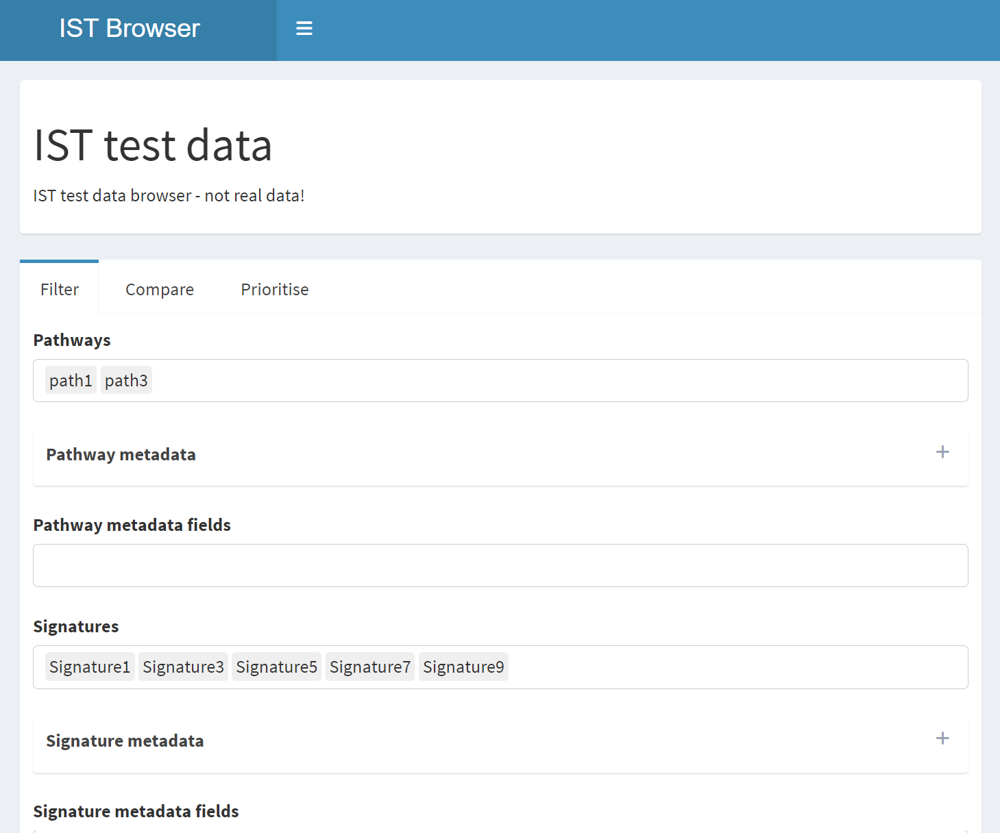
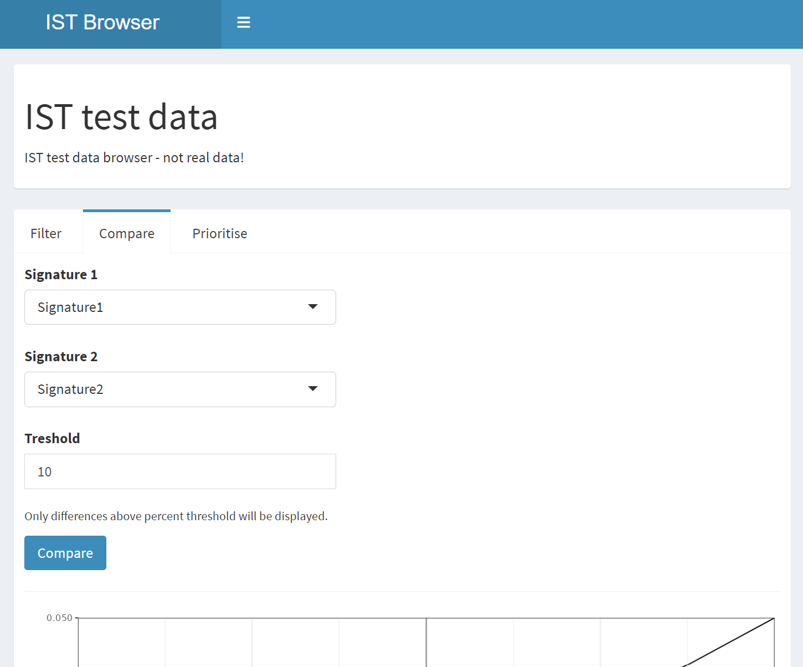
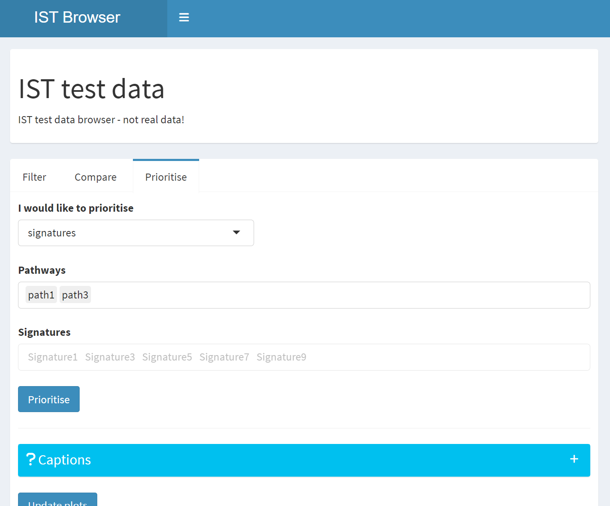
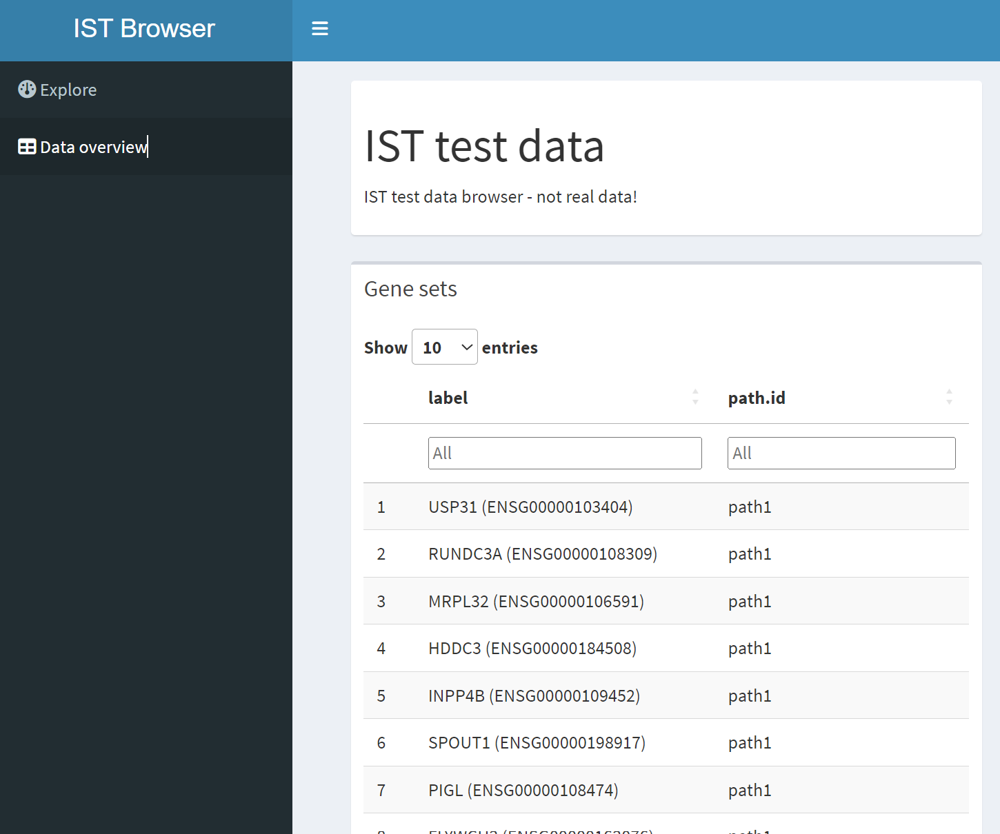

# In Silico Treatment Modelling Browser

The purpose of this R package is to provide an interactive shiny app to browse results generated with the In Silico Treatment `IST` R package.

# Overview

**Filter** page (landing page), where one can filter and compare signatures

{width=80%}

**Compare** page, where one can compare two signatures

{width=80%}

**Prioritise** page, where one can prioritise signatures across pathways, or pathways across signatures

{width=80%}

**Data overview** tab, where one can browse the bare bones data for gene sets and signatures (under construction)

{width=80%}

# Requirements

The `IST` package must be installed to run this browser.
This app only needs an `ist.results` object saved as a `.rds` file, with some extra required fields in the sample and pathway metadata.

A `pathways.meta` data.frame has to be defined, when creating the `ist.pathways` object, with at least the following columns with pathway metadata:

* `path.id`: character, names as in the pathway data frame
* `path.class`: character, either `"default"` to show in the app loading page, or something else 

The signature metadata, as provided in `tab.meta` for the `ist.signatures` object, must include two extra columns

* `sig.class`: character, `"default"`, `"positivecontrol"`, or something else
* `study.id`: character, anything, for fill colors in the boxplot


# Usage

* Load package: `Ctrl/Cmd + Shift + L`
* Launch application: `ISTBrowser::run()`

or:

```
devtools::load_all()
ISTBrowser::run()
```

# Deployment

## Development

Assuming code is checked out in `~/ISTBrowser`, create application bootstrap script `~/ShinyApps/istbrowser/app.R`:

```r
shinyOptions(ist.result.path = "/path/to/ist/results/rds/file.rds")
shinyOptions(ist.browser.title = "Idiopathic Pulmonary Fibrosis")
devtools::load_all(paste(Sys.getenv("HOME"), "ISTBrowser", sep="/"))
shiny::shinyAppDir(system.file("app", package = "ISTBrowser"))
```

For testing purposes, one can use the sample object that comes in the `IST` package, `IST::sample.results.ist`, save as a `.rds` file, and load it with the app.

## Production

Create application bootstrap script `app.R`:

```r
shinyOptions(ist.result.path = "/path/to/ist/results/rds/file.rds")
shinyOptions(ist.browser.title = "Idiopathic Pulmonary Fibrosis")
shinyOptions(ist.browser.description = "Comparison of disease models for IPF.")
shiny::shinyAppDir(system.file("app", package = "ISTBrowser"))
```
